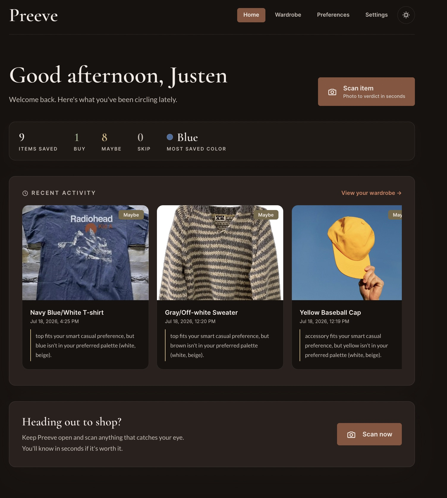
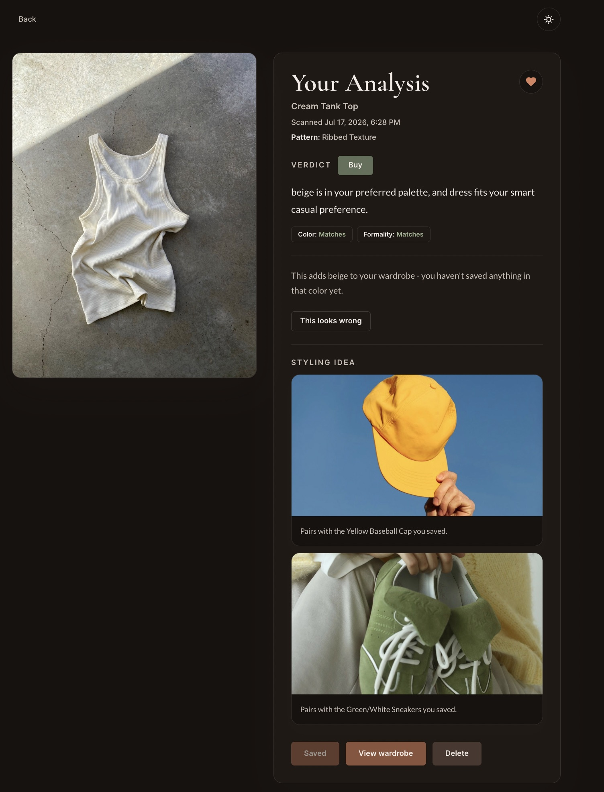
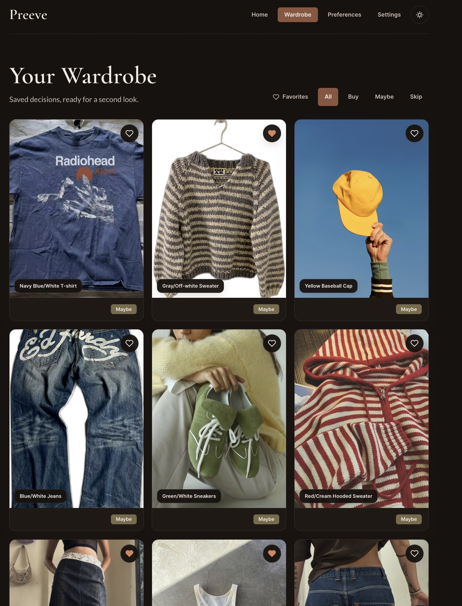

# Preeve

Preeve is a mobile web app that helps you decide whether to buy a clothing item while you are still standing in the store. You take a photo of the piece, and the app classifies what it is, compares it against the style preferences you set up, and returns a Buy, Maybe, or Skip verdict with the reasoning behind it.

The idea came from a pretty ordinary problem: it is hard to tell in the moment whether something actually fits the wardrobe you already own, or whether you just like it because you are standing in a well-lit store. Preeve tries to answer that in a few seconds.

One design decision is worth calling out early. The verdict itself is not generated by a language model. Computer vision handles perception (what category is this, what color, what fit), but the actual Buy/Maybe/Skip decision comes from a deterministic rules engine that scores the item against your saved preferences. The same item with the same preferences always produces the same verdict, and the explanation you get is the real reason a rule fired rather than a plausible-sounding sentence a model wrote after the fact.

## Screenshots

The home dashboard, showing wardrobe stats and recent scans.



A scan result. The verdict, the rationale, the signal breakdown, and pairing suggestions pulled from items already saved.



The wardrobe log, filterable by verdict and favorites.



## Features

- Photo scanning with automatic classification of category, color, pattern, and fit
- Deterministic Buy/Maybe/Skip verdicts scored against saved color, fit, and formality preferences
- Plain-English rationale explaining which signals matched and which did not
- A signal checklist breaking each verdict into its component parts
- Pairing suggestions drawn from items already in your wardrobe, falling back to a curated dataset
- Closet insights that notice gaps and patterns across what you have saved
- Wardrobe log with verdict and favorite filtering
- Manual correction flow, so if the vision model gets the category or color wrong you can fix it and the verdict recomputes
- Verdicts recompute live from current preferences, so changing your palette updates previously scanned items
- Per-user rate limiting on the scan endpoint to keep inference costs bounded
- Installable as a PWA with offline app shell caching (API responses are deliberately never cached)
- Light and dark themes

## Tech Stack

**Frontend**

- Next.js 16 (App Router, Turbopack)
- React 19
- Tailwind CSS v4
- TanStack Query for server state
- Serwist for the service worker and PWA behavior

**Backend**

- FastAPI on Python 3.12
- SQLAlchemy 2 with async support
- Alembic for migrations
- Pydantic for request and response validation

**Infrastructure and services**

- PostgreSQL (Neon)
- Cloudflare R2 for photo storage, accessed through short-lived presigned URLs
- Clerk for authentication
- Replicate for zero-shot CLIP classification and background removal
- OpenAI (gpt-4.1-mini) for structured visual attribute extraction

## Architecture Notes

The backend is a single FastAPI service. Photos are compressed and background-removed before classification, then stored in a private R2 bucket under a server-generated key namespaced by user ID. The client never receives a raw bucket path, only a presigned URL that expires.

Classification runs two things concurrently: CLIP for category and color, and a vision model for structured attributes like pattern and fit. If attribute extraction fails, the app degrades gracefully and still produces a verdict from the CLIP results alone.

Verdicts are computed in `backend/verdict_engine.py`. It builds a list of independent signals (color, fit, formality), each of which either matches or does not, then composes them: all matching is a Buy, all failing is a Skip, anything mixed is a Maybe. Verdict and rationale are recomputed on every read rather than trusted from the stored column, which is why updating your preferences immediately changes what previously scanned items say.

## Prerequisites

- Node.js 20.9 or later
- Python 3.12
- A PostgreSQL database (Neon works well, or run Postgres locally)
- Accounts and API keys for Clerk, Cloudflare R2, Replicate, and OpenAI

## Installation and Setup

Clone the repository and move into it.

```bash
git clone https://github.com/justenhilliard/preeve.git
cd preeve
```

### Backend

```bash
cd backend
python -m venv .venv
source .venv/bin/activate
pip install -r requirements.txt
```

Create `backend/.env` using `.env.example` at the repository root as a reference, then run the migrations.

```bash
alembic upgrade head
```

Start the API.

```bash
uvicorn main:app --reload --port 8000
```

### Frontend

```bash
cd frontend
npm install
```

Create `frontend/.env.local` using the frontend section of `.env.example`, then start the dev server.

```bash
npm run dev
```

The app runs at `http://localhost:3000` and expects the API at `http://localhost:8000`.

### Environment Variables

Every required variable is documented in `.env.example` at the repository root. Frontend variables belong in `frontend/.env.local`, backend variables in `backend/.env`. Neither file is committed.

The backend needs `DATABASE_URL`, `CLERK_SECRET_KEY`, `CLERK_WEBHOOK_SIGNING_SECRET`, `OPENAI_API_KEY`, `REPLICATE_API_TOKEN`, the four `R2_*` values, and `CORS_ALLOWED_ORIGINS`. The frontend needs `NEXT_PUBLIC_CLERK_PUBLISHABLE_KEY`, `CLERK_SECRET_KEY`, and `NEXT_PUBLIC_API_BASE_URL`.

## Testing

```bash
cd backend
source .venv/bin/activate
python -m pytest tests
```

```bash
cd frontend
npx tsc --noEmit
npx eslint src
```

## API Overview

The backend exposes a small REST API. Full request and response shapes live in [`docs/API_ROUTES.md`](docs/API_ROUTES.md).

- `POST /api/items/scan` uploads a photo and returns a classified item with its verdict
- `GET /api/items` lists saved wardrobe items, filterable by verdict and favorite status
- `GET /api/items/{id}` returns one item with its verdict, signals, pairings, and closet insight
- `PATCH /api/items/{id}/correct` overrides the detected category or color and recomputes the verdict
- `GET /api/preferences` and `PUT /api/preferences` manage style preferences
- `POST /api/webhooks/clerk` handles user lifecycle events, with signature verification

## Project Structure

```
preeve/
├── backend/          FastAPI service, verdict engine, migrations, tests
├── frontend/         Next.js app
└── docs/             Product requirements, API reference, schema, design system
```

## Documentation

- [Product Requirements](docs/prd.md)
- [API Routes](docs/API_ROUTES.md)
- [Database Schema](docs/DATABASE.md)
- [Design System](docs/DESIGN_SYSTEM.md)
- [Tech Stack](docs/TECH_STACK.md)
- [Deployment Notes](docs/DEPLOYMENT.md)

## License

MIT
